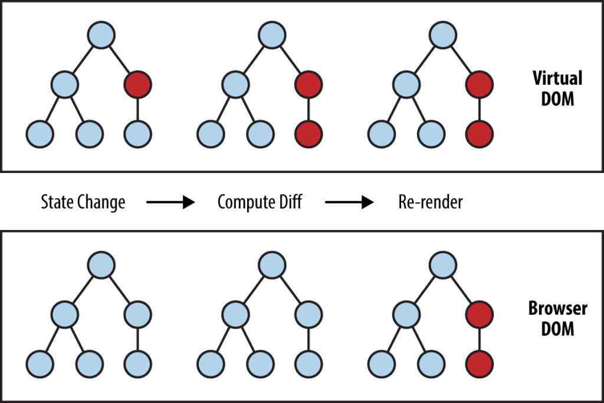

# INTRODUCTION

## What is React and Why Use It?
<div style="text-align: center;">
    <br>
</div>
React is a **JavaScript library** for building user interfaces, primarily for single-page applications (SPAs).  
It allows developers to create **reusable UI components** that manage their own state.  
React is widely used because it is **fast, efficient, and declarative**, making complex UI easier to build and maintain.

**Why use React?**
- Reusable components reduce code duplication.
- Virtual DOM makes updates fast and efficient.
- Large ecosystem and community support.
- Works well with other libraries and frameworks.
- Great for building dynamic and interactive web applications.

## Virtual DOM and How React Differs from Plain JavaScript
<div style="text-align: center;">
  
</div>

- **Plain JavaScript:** Updates the real DOM directly. This can be slow when the UI is large or changes frequently.  
- **React:** Uses a **Virtual DOM**, a lightweight copy of the real DOM.  
  - When state changes, React updates the Virtual DOM first.  
  - It calculates the **minimal set of changes** needed.  
  - Only updates the real DOM where necessary → faster performance.

## Components and Component-Based Architecture
- **Components** are the building blocks of a React application.  
- They are **self-contained pieces of UI** that can manage their own data and logic.  
- Components can be **reused** across the application.  

**Example of components:**
- Button
- Form
- Navbar
- Footer
- Entire pages

**Component-based architecture benefits:**
- Easier to maintain and scale
- Encourages code reuse
- Improves readability

## JSX (JavaScript + XML)
- **JSX** is a syntax extension for JavaScript that looks like HTML.  
- It allows you to write UI code in a way that is easy to read and write.  
- React **transpiles JSX to JavaScript** using tools like Babel.  

**Example:**
```jsx
const element = <h1>Hello, React!</h1>;